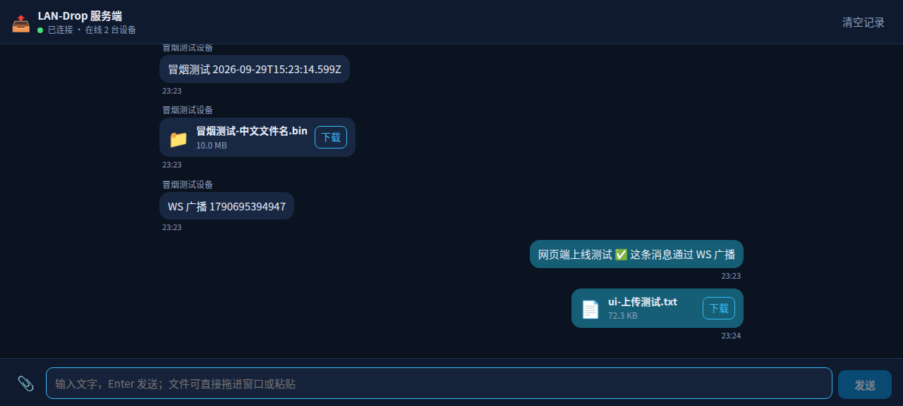

# LAN-Drop

局域网文件 / 文字传输工具，用来替代已下线的 **Edge Drop**（Edge 的跨设备 Drop 功能）。PC 作为服务端，Android 作为客户端，不依赖任何云服务与账号。

## 为什么做这个

Edge Drop 下线后，在自家局域网里「电脑 ↔ 手机」随手丢一段文字、几张图、一个几百 MB 的安装包，反而又变麻烦了：微信要压缩、网盘要登录要上传、数据线要插拔。LAN-Drop 只做一件事——**同一个 WiFi 下，两台设备之间直传，数据不出局域网。**

## 架构

```
        ┌──────────────────────── PC（Linux / Windows）────────────────────────┐
        │                                                                     │
        │   Node.js 服务端                                                    │
        │   ├─ HTTPS :8787   REST + 文件上传/下载（Range 断点续传；自签 TLS）  │
        │   ├─ WSS   :8787   文字消息、事件、在线状态、传输进度                │
        │   ├─ HTTP  :8789   回环明文监听器（控制台/配对码，免证书警告）       │
        │   ├─ SQLite        设备 / 消息 / 传输记录（node:sqlite 内置）        │
        │   ├─ 文件仓库      ~/.local/share/lan-drop/files/…                  │
        │   └─ tls/          自签证书 + 私钥 + 指纹（数据根内）               │
        │                                                                     │
        │   Web UI（浏览器 / 手机浏览器兜底）                                  │
        └─────────────────────────────────┬───────────────────────────────────┘
                                          │  局域网，无云、无账号，TLS 加密
                    ┌─────────────────────┴─────────────────────┐
                    │                                           │
        ┌───────────▼────────────┐                  ┌───────────▼────────────┐
        │  Android 客户端         │                  │  手机浏览器（PWA 兜底） │
        │  Kotlin + Compose       │                  │  零安装                 │
        │  Room 缓存会话与传输记录 │                  │  须保持页面打开          │
        │  扫码 / 扫描 / 手输配对  │                  └────────────────────────┘
        │  指纹固定（TOFU）        │
        └────────────────────────┘
```

> 配对、分享、多选、缓存维护均已实现。剩余待办见 [docs/TODO.md](docs/TODO.md)
> ——文档只描述已经能跑的东西。

**分工原则**：控制面走 WebSocket，数据面走 HTTP。文件字节永不进 WS 通道，避免与聊天消息互相队头阻塞，同时白拿 HTTP 的 `Range` 断点续传与浏览器直下能力。

## 服务端数据保存在哪里

没有云、没有账号，所有数据只落在宿主 PC 的本地磁盘上。默认数据根：

| 场景 | 路径 |
| --- | --- |
| Linux（源码 / AppImage / deb） | `~/.local/share/lan-drop`（跟随 `XDG_DATA_HOME`） |
| Windows（源码 / 手动启动） | `%LOCALAPPDATA%\LAN-Drop` |
| Windows 安装版（桌面壳） | `%LOCALAPPDATA%\LAN-Drop-Data` |

任何一个都能用 `LAN_DROP_DATA_ROOT` 整体改根。Windows 安装版之所以要换地方：NSIS
currentUser 的默认安装目录同样是 `%LOCALAPPDATA%\LAN-Drop`，数据根留在安装目录里的话，
**卸载会连数据一起删掉**——所以由桌面壳注入该变量（用户显式设过则不覆盖）。

数据根内部（改根则下面整体跟着走）：

| 路径 | 内容 |
| --- | --- |
| `lan-drop.sqlite`（含 `-wal` / `-shm`） | 设备、消息、文件元数据、上传会话 |
| `files/<年>/<月>/<fileId>_<文件名>` | 文件仓库本体；可用 `LAN_DROP_FILES_ROOT` 单独挪到别的盘 |
| `tmp/<uuid>.part` | 未完成上传的临时分片；超过 24 小时没有新分片的会话会被置为已中止并删掉分片 |
| `server.json` | 服务端身份 `serverId`，手机端的配对凭据与它绑定 |
| `tls/cert.pem` `key.pem` `tls.json` | 自签 TLS 证书与私钥；**私钥丢失 = 所有设备需重新配对**，备份请连同此目录一起拷 |

三件值得知道的事：

- **备份 = 拷走整个数据根**，其中 `server.json` 必须一起拷且保持合法 JSON：丢了它服务端会生成
  新的 `serverId`，所有已配对设备都得重新配对；它损坏则服务端直接启动失败（不会静默换 ID）。
- **不要用 SQLite 命令行手工改库**：服务端进程持有 WAL 连接，手工写入会与它互相覆盖。
- **手工清空 `files/` 的后果**：文件消息还在，但点下载会得到「文件已不在磁盘上」（410）而不是
  404——这是刻意区分「记录指向的文件被外部删了」与「记录本身不存在」。

另外，日志不在数据根里：桌面壳的 sidecar 日志在 Windows
`%LOCALAPPDATA%\io.github.illagercpr.landrop.desktop\logs\server-sidecar.log`、Linux
`~/.local/share/io.github.illagercpr.landrop.desktop/logs/`。磁盘占用默认**永久保留**，
要限制请看下文「消息保留策略（P4-5）」的双阈值环境变量。

## 安全与威胁模型

LAN-Drop 的默认 posture 是「**局域网内全程加密 + 指纹固定**」，同时把信任边界说清楚。

- **传输全程 TLS（0.2.0 起默认开启）**：局域网端口的 https/wss 用自签证书加密，
  文件字节、文字消息、凭据（Authorization 头）全部密文。自签证书不走 CA——
  **SPKI 指纹固定**才是信任边界：证书公钥的 sha256 随配对二维码下发（相机是
  攻击者插不进的视觉信道），客户端固化后每次连接核对，不符即拒绝。中间人没有
  服务端私钥，冒充必然失败；DHCP 换 IP、证书 SAN 过时都不影响固定关系。
  - 证书持久化在数据根 `tls/`（私钥丢失 = 所有设备重新配对）；`LAN_DROP_TLS=0`
    可整体退回明文（不建议）。
  - 指纹同时出现在 `/info`、配对响应与二维码三处，配对开始/结束各核对一次。
  - **手输地址配对**（不扫码）没有外部指纹可核对，信任边界退化为 TOFU
    （与 SSH 首连相同）：首次连接采纳服务端自报指纹并固化。
  - 浏览器（Web 控制台的另一台 PC 访问）无法做指纹固定：首次访问自签证书会弹
    警告，这是浏览器模型的天花板——这正是控制台与配对码接口同时监听
    **回环明文端口 8789** 的原因，宿主机本机使用不受影响。
- **升级提示**：0.1.x 的旧配对凭据里没有指纹。服务端升到 0.2.0（TLS 默认开）后，
  旧设备需「解除配对 → 重新扫码」一次（聊天缓存保留，重配后立即恢复）；App 会
  横幅提示「服务端已启用加密传输」。
- **威胁对象是「同网段的陌生设备」**：配对码（约 30 bit 熵、10 分钟有效、用一次即换，
  只有服务端宿主本机能读到）+ TLS 指纹固定构成两道防线；ARP 欺骗式的中间人在
  指纹固定面前无法冒充服务端。
- **配对成功 = 共享房间**：房间内没有权限分级，任何已配对设备可以读写全部消息、
  上传任意大小的文件、下载全部文件。LAN-Drop 假设房间里的设备都属于你（或你信任的人）。
- **设备令牌不过期，但可撤销**：token 长期有效是便利性取舍；止损手段是 Web 控制台的
  「设备管理」（见下节）。服务端日志已把查询串里的 token 脱敏（`token=[REDACTED]`）。
- **`?token=` 查询参数凭据是已知残留**：浏览器的 ``/`<a>` 与 WebSocket 带不了
  自定义请求头，只能把 token 放进 URL。服务端把它收窄到**文件下载与 WS 握手**两条路
  （其余接口一律要求 Authorization 头），但它仍会留在浏览器历史与下载记录里。
  TLS 加密让它无法被网段内监听者读到。介意的话用应用内上传/下载（Android 全走请求头）。
- **服务端主动拒绝公网**：默认 `LAN_DROP_PRIVATE_ONLY=1`，非私有网段来源的请求一律 403。
- **磁盘满保护**：建上传会话即预检剩余空间（不足回 507 `disk_full`），分片写入遇
  ENOSPC 回 507 且保留续传现场；预留空间默认 64 MiB（`LAN_DROP_RESERVE_BYTES` 可调）。

## 设备管理：撤销与重新配对

Web 控制台右上角「设备管理」：列出全部已配对设备（平台、在线状态、最近活跃），
可逐台**撤销**。撤销 = 删设备行（token 哈希随行而去，全部凭据立即失效）+ 回收该设备
的上传会话与临时分片 + 踢下线（WS 4401，客户端停止重连并提示重新配对）。

- 只有**服务端宿主**（回环地址）能撤销：PC 控制台是管理入口，已配对设备之间无权互相踢。
- 消息记录保留：发送者名字是随消息存的，撤销设备不影响历史展示。
- 撤销手机后重新使用：手机端会显示「凭据失效」，按提示在服务端重新配对即可。

## 目录结构

```
LAN-Drop/
├─ apps/
│  ├─ server/            Node + TypeScript 服务端（HTTP / WS / SQLite / 文件流）
│  ├─ web/               Vite + React + TypeScript（PC 主界面 + 手机 PWA 兜底）
│  └─ desktop/           Tauri 2.x 桌面常驻壳（Rust 托盘 + Node sidecar）
├─ packages/
│  └─ protocol/          协议单一事实源（TS 类型 + JSON Schema）
├─ android/              Kotlin + Jetpack Compose 客户端（独立 Gradle 构建）
├─ docs/                 技术选型、协议、路线图
└─ scripts/              环境准备、Windows 防火墙、smoke 冒烟
```

## 技术栈

| 层 | 选型 |
| --- | --- |
| 服务端 | Node.js 24 + TypeScript + Fastify + `ws` + `node:sqlite` |
| 前端 | Vite + React + TypeScript |
| 桌面壳 | Tauri 2.x（Rust 托盘，无窗口；Node 服务端以 sidecar 内嵌；Windows NSIS 安装包 / Linux AppImage） |
| Android | Kotlin + Jetpack Compose + Material 3 + Room + OkHttp + kotlinx.serialization |
| 传输 | 局域网 HTTP(S) + WebSocket，二维码/UDP 广播发现，Token 配对 |
| 数据根 | Linux `~/.local/share/lan-drop`；Windows `%LOCALAPPDATA%\LAN-Drop` |

## 开发环境

前置：WSL2（Ubuntu）/ Linux，Node.js ≥ 24，JDK 21。

```bash
# 1) 用户级安装 Android SDK（无需 root，不使用 snap）
bash scripts/install-android-sdk.sh

# 2) 让手机能访问 WSL 中的服务端
#    在 Windows 上以【管理员】身份运行 PowerShell（会弹 UAC，只需一次）：
#    powershell -ExecutionPolicy Bypass -File scripts\windows-allow-lan.ps1
#    未执行此步时，只有 localhost 能访问，手机会超时（WSL 镜像模式下
#    Hyper-V 防火墙默认拦截局域网入站，已实测确认）。

# 3) 让当前 shell 拿到 JDK / Android SDK / Gradle 路径
source scripts/dev-env.sh

# 4) 安装依赖并启动服务端
pnpm install
pnpm dev            # 启动后控制台会打印「手机访问 http://<IP>:8787」

# 5) 构建 Web UI（服务端检测到 apps/web/dist 后自动托管，浏览器直接访问 :8787）
pnpm web:build      # 开发热更可用 pnpm web:dev（Vite 代理 /api 到 8787）

# 6) 构建 Android 调试包（产物：android/app/build/outputs/apk/debug/app-debug.apk）
cd android && ./gradlew :app:assembleDebug

# 7) 跑验证
pnpm verify                                      # 一键门禁：TS 类型 + 单测 + 自起服务端跑全量冒烟
cd android && ./gradlew :app:testDebugUnitTest   # Android：109 项 JVM 单测，无需设备/服务端

# 8) 无线调试部署（手机：开发者选项 → 无线调试）
adb pair <手机IP>:<配对端口> <6 位配对码>
adb install -r android/app/build/outputs/apk/debug/app-debug.apk

# 9) 桌面端（Tauri；产物在 dist/：Windows NSIS 安装包 / Linux AppImage）
pnpm desktop:resources      # esbuild 打服务端 bundle（metafile 自包含检查）+ 拷 web/dist + 按平台拉 sidecar node
# Windows 侧：构建树在 E:\ClaudeCode\lan-drop-desktop-build（Windows 本地盘，勿放 WSL 路径），
#             Windows 本机 node 跑 @tauri-apps/cli build（NSIS）
# Linux 侧（WSL）：装 4 个系统包后 tauri build --bundles appimage
# 详见下文「桌面端（Tauri 常驻壳）与部署」小节
```

依赖源已固化到国内镜像（见 `.npmrc`、`android/settings.gradle.kts`、
`android/gradle/wrapper/gradle-wrapper.properties`）：npm 走 npmmirror，
Maven 走 Google 直连 + 阿里云，Gradle 发行版走腾讯云镜像。

Android 工具链版本已实测锁定（AGP 9.4.1 / Gradle 9.7.1 / Kotlin 编译器插件 2.2.10 /
KSP 2.3.12 / compileSdk 37 / minSdk 33），**改动前请先读
[docs/技术选型与开发计划.md](docs/技术选型与开发计划.md) §2.5**，那里记录了三条
会直接导致构建失败的硬约束。

## 路线图

- **P0** 环境准备与仓库骨架 ✅
- **P1** 服务端核心 + Web UI ✅（手机 ↔ PC 已实测互发文字与文件；大文件项以 ~180 MB 视频代替验收）
- **P2** Android 原生客户端 MVP ✅（配对、时间线、文字、文件收发、Room 离线缓存）
- **P3** 断点续传 ✅（暂停/继续/崩溃恢复）· 前台服务 + 通知 ✅（息屏续传）· UDP 自动发现 ✅（扫描配对 + 断线找回）· 自动接收文件 ✅（默认关）· 摄像头扫码 ✅ · 系统分享面板与缩略图移至 P4
- **P4** 桌面常驻壳（Tauri 托盘 + Node sidecar）✅ · 系统分享面板 + 多选批量 ✅ · 时间线缩略图 ✅ · 传输暂停/继续 + 链接可点 ✅ · 消息保留策略 ✅
- **安全加固轮（2026-10-01）** 0 字节文件上传 ✅ · token 日志脱敏与查询凭据收窄 ✅ · 分片写入互斥 + 客户端收尾摘要自证 ✅ · 设备撤销（Web 面板）✅ · CI（GitHub Actions）✅
- **发布轮 v0.2.0（2026-10-01）** 自签 TLS + 指纹固定 ✅ · 磁盘满边界 ✅ · Android 多服务端 ✅ · Web 无障碍 ✅ · MIT LICENSE + CHANGELOG ✅ · Android release 签名 + minify ✅
- **未排期** 后台「常驻接收」开关（刻意不做，理由见 P3-2）· macOS 桌面壳

详见 [docs/技术选型与开发计划.md](docs/技术选型与开发计划.md) 与 [CHANGELOG.md](CHANGELOG.md)。

详见 [docs/技术选型与开发计划.md](docs/技术选型与开发计划.md)。

## 当前进度：P1 / P2 / P3 全部 / P4-2 至 P4-6 已验收通过（P4-1 便携包曾交付，随桌面壳落地放弃）

### 服务端展示名

手机聊天页标题、Web 控制台标题显示的都是服务端所在机器的名字，默认取主机名
（如 `SW-ShittimLight`），可用 `LAN_DROP_SERVER_NAME` 覆盖。

之前写死为「LAN-Drop 服务端」是不合适的：那个位置唯一的职责是回答
「我在跟哪台机器说话」，而「服务端」既是实现术语、多台 PC 时又全都同名。
配套修掉一处死代码——`ConnectionStore.updateServerName()` 从来没有被调用过，
导致 PC 改名后手机永远显示配对那天的旧名字；现在每次回到前台会顺带核对一次。

### PC 端（Web UI）

浏览器打开 `http://<PC局域网IP>:8787`，扫码或一键配对后即可互发文字与文件：

| 配对页（PC 展示二维码） | 聊天页（文字 + 文件卡片） |
| --- | --- |
|  |  |

Token 配对（二维码 / 手输 / 本机一键）、聊天时间线（文字 / 链接 / 文件卡片 + 图片预览）、
拖拽 / 粘贴 / 选单上传（4 MiB 分片 + 断点续传 + 暂停/继续/取消 + sha256 校验）、Range 下载（含中文文件名 RFC 5987）、
WS 实时广播与指数退避重连（离线缺口由 `since=seq` 补拉）。
`node scripts/smoke-api.mjs` 67 项端到端冒烟全绿（HTTP + WebSocket + 断点续传 + UDP 发现）。
TS 侧另有 26 项单测：`pnpm -r test`（15 项链接规则 + 11 项上传状态机，`node --test` 直接跑 `.ts`）。

### Android 客户端（原生）

配对支持四种方式：**摄像头扫码**（对准 PC 配对页上的二维码，自动填地址与配对码）、
**扫描局域网**（UDP 自动发现，点一下即填地址）、手输「服务器地址 + 配对码」、
粘贴 PC 上的配对链接自动填入；配对后凭据落盘、重启免重配。时间线、在线状态、传输记录三个界面：
文字消息乐观发送（失败可重试/丢弃）、文件经 SAF 选择后 4 MiB 分片上传、
下载落盘系统「下载/LAN-Drop」（MediaStore，无需存储权限）、传输记录可取消并显示失败原因。

**多服务端（0.2.0）**：「更多 → 服务端管理」可同时保存多台服务端的凭据并随时切换、
解除配对或添加新服务端。消息缓存与传输记录按服务端隔离（`(server_id, seq)` 联合唯一），
切换服务端不清缓存、在途传输不中断（恢复时连任务自己的服务端）。

**摄像头扫码**在客户端本地完成：CameraX 分析帧（YUV）→ zxing 解码 → 复用与「粘贴链接」
同一套 `#pair=CODE` 解析（0.2.0 起二维码还携带 `#fp=` TLS 指纹，配对时与服务端自报值
核对一致才固化）。相机权限只在扫码页申请，扫到即自动断开相机。聊天页
「更多 → 清除本地消息缓存」接上了缓存修复路径：清空 Room 缓存后立即从服务端全量重拉
（服务端记录不受影响），用于本地缓存损坏或时间线显示异常时自救。

release 构建已启用**正式签名与 R8 收缩**（42.9 MB → 4.2 MB）：签名材料在
`android/keystore/`（gitignored，**丢失后无法再为更新签名，务必备份**），
产物在 `android/app/build/outputs/apk/release/app-release.apk`。

**真机验收（2026-09-30，vivo V2301A / Android 14）：**

| 项 | 结果 |
| --- | --- |
| 扫码 → 自动填入 → 配对 | ✅ 手机对准 PC 屏上的二维码，相机扫到即自动断开；地址与配对码自动填入并提示「已从二维码填入地址与配对码」，点配对进入聊天页，服务端设备行同步出现 |
| 清除本地消息缓存 | ✅ 确认框明示「服务端的记录不受影响」；清空后时间线立即清空并自动全量重拉，两端最终一致 |

**真机验收（2026-09-30，vivo V2301A / Android 14）：**

| 项 | 结果 |
| --- | --- |
| 配对 → 首次全量同步 | ✅ 服务端既有 11 条消息全部拉到本地 |
| 手机 → PC 文字 | ✅ 服务端收到，发送者名正确 |
| PC → 手机文字 | ✅ 中文 / emoji / 换行均正确，经 WS 实时到达 |
| PC → 手机文件 20 MB | ✅ 落盘 `Download/LAN-Drop/`，sha256 与服务端逐字节一致 |
| 手机 → PC 文件 8 MB | ✅ 2 个分片，服务端 sha256 与源文件一致 |
| 断网重启后历史仍在 | ✅ 停服务端 + 强杀 App 重启，时间线仍完整；飞行模式下同样成立 |
| 断线自动重连 | ✅ 服务端恢复后 3 秒内回到「在线」 |
| 离线缺口补偿 | ✅ App 离线期间 PC 发的消息，重启后自动补齐 |

`cd android && ./gradlew :app:testDebugUnitTest` 另有 109 项 JVM 单测（无需设备与服务端）：
18 项协议一致性（拿服务端真实响应样本验证 Kotlin 侧模型，防两端协议漂移）+
6 项 WS 事件信封解析（`message.new` 真实样本、`message.deleted` / `messages.purged` 解析为对应事件，缺 payload、未知类型与坏 JSON 拒绝）+
17 项通知逻辑（多任务进度合并、主动暂停与网络中断的提醒判据、速率平滑与回退重置）+
6 项发现应答解析（非本服务 / 未来版本 / 坏报文一律拒绝）+
18 项分享内容归一化（按媒体条目身份去重、`ClipData` 兜底、`data` 兜底、空白与非分享 action）+
18 项缩略图取图顺序（本地副本优先、下载中不重复拉原图、超限不自动取原图）+
12 项预览尺寸与降采样算术（4:3 / 3:4 / 小图不放大 / 缓存档位）+
3 项链接判定（15 条边界与事实源 `isLinkText` 逐条对应、消息类型常量、换行与制表符）+
5 项扫码解码（`scan/QrDecoderTest`：正常解码、空白帧返 null、非法尺寸返 null、行跨度 stride 与像素间隔 pixelStride 的打包还原）+
6 项配对链接解析（`data/prefs/PairingPayloadTest`：URL 提取配对码与来源、无 hash、码被 `?`/`/`/换行截断、裸 IP 补默认端口、路径+查询折叠为来源、空白输入）。

> 实测环境备注：当时手机 ←→ WSL 的 WiFi 吞吐只有 ~0.5 MB/s（`adb pull` 8 MB 用 15 秒），
> 应用层下载跑到 ~375 KB/s，约为链路的 75%，属正常开销。**瓶颈在无线 AP（设备老化），
> 不在实现**——同一套代码在正常链路上应能跑满百兆/千兆。定位这类问题要分层测：
> 先用 `adb pull`/`adb push` 测链路，再用应用内传输测实现，两者对比才有意义。
> 也正因为这条链路，断点续传不是锦上添花：1 GB 要传 35 分钟，任何一次中断都不能从头再来。

## 断点续传

链路慢，所以「传了一半断掉」是常态而不是异常。P3 的断点续传覆盖三种中断来源：
手动暂停、网络抖动、进程被杀。

**两端各有一条不变量**：

| 方向 | 权威进度在哪 | 写入前必须做的事 |
| --- | --- | --- |
| 上传（手机 → PC） | 服务端 `GET /api/v1/uploads/:id` 的 `receivedBytes` | 服务端 `ftruncate` 掉自己那侧的残字节（**必需**） |
| 下载（PC → 手机） | 本地 MediaStore 文件的真实长度 | 客户端定位到 offset 写入，并 `ftruncate` 对齐（兜底不变量） |

两条的分量不同，值得说清楚：

- **上传侧是必需的。** 服务端用 `O_APPEND` 追加写，不截断就会把新数据接在残字节后面，
  文件从此永久错位。已用负向冒烟用例实测复现：把 `truncateTo` 注释掉，
  「续传后收尾」立刻从通过变成 `sha256_mismatch`。
- **下载侧是兜底的。** `"rw"` 打开的 fd 不是 `O_APPEND`，写指针定位到 offset 后是逐字节
  覆盖，服务端 `Range` 返回的也正是从该 offset 开始的字节，所以对齐本身就已正确。
  截断的作用是把「开始写之前文件长度恒等于 offset」变成显式保证，防住
  「服务端返回的字节比文件原有尾巴还短」这类将来可能出现的情形。

「残字节」来自中途断流：请求体只落了一半盘，而两端记账的进度都停在这一片之前。

- 服务端新增 `GET /api/v1/uploads/:id`（查权威进度）与 `GET /api/v1/uploads?state=`（列会话），
  均按设备隔离，且不泄露临时路径。
- 客户端「暂停」= 取消协程但**不动两端现场**：服务端会话留在 `open`、临时分片留在磁盘、
  本地半成品留在原地；「继续」时上传按服务端、下载按本地文件重新对齐。
  Web 控制台的暂停/继续走的是同一套服务端语义（见 [传输暂停/继续与链接可点（P4-4）](#传输暂停继续与链接可点p4-4)），
  区别只在它的「暂停」是浏览器里的任务停在分片边界——关掉标签页就等于放弃，服务端会话留给清理定时器。
- 进程被杀后重启：记录落到「已暂停」而不是「失败」，点一下即可接着传。
  刻意**不做自动续传**——App 启动时 WiFi 常常还没就绪，自动重试会把可恢复的任务烧成失败。
- 网络抖动导致的失败同样保住进度：只有 4xx（除 408/429）与权限失效才判永久失败。
- 下载结束时显式核对字节数：服务端截断连接时 `read()` 返回 -1 而不是抛错，
  不核对就会把半截文件当成功落盘。

## 后台传输与通知

断点续传解决「丢了能捡回来」，前台服务解决「根本不丢」。以实测 0.5~1.3 MB/s，
1 GB 要传十几分钟到半小时，用户必然中途锁屏；没有前台服务，应用退到后台后
进程会被系统冻结，传输就停在半路。

- 服务只在**有传输在跑**时存在：开始传输拉起、全部结束 1.5 秒后自行退出。
  刻意不做常驻——本应用的收文件是「对方发来消息 → 用户点下载」，
  没有需要 7×24 运行的后台任务，常驻只会白耗电、白占 `dataSync` 配额。
- 三条通知渠道分开建立（进度 = 低、结果 = 中、新消息 = 中）。渠道的重要性一旦
  建立就只有用户能改，所以不能图省事合成一条。
- 通知内容由纯函数算出（`notify/TransferNotice.kt`）：多个传输合并成一条、
  进度用千分比（小文件不会长时间停在 0%）、速率走指数滑动平均。
- 通知按钮：单个传输在跑时给「暂停 / 取消」（多个并发时不给，一个按钮指谁都不对）。
- **哪些结束该提醒，判据是「用户有没有主动暂停」**：主动暂停（`error` 为空）静默，
  网络中断落到「已暂停」时带上了原因，此时必须提醒——屏幕关着的人不会知道
  文件已经静悄悄地不传了。
- 新消息只在应用不在前台时通知。

**真机验收（2026-09-30，vivo V2301A / Android 14）：**

| 项 | 结果 |
| --- | --- |
| 息屏下载 40 MB | ✅ 全程 `mWakefulness=Asleep`，进度持续推进至完成，落盘 sha256 与源一致 |
| 前台服务状态 | ✅ `isForeground=true types=00000001`（dataSync），通知 `category=progress actions=2` |
| 进度通知 | ✅ 「正在接收 · 13.0 MB / 40.0 MB」＋「1.0 MB/s」，`progress=325/1000`（13/40 精确对应） |
| 完成通知 | ✅ 「文件已收到 · landrop-probe-40mb.bin · 40.0 MB」 |
| 从通知点「暂停」 | ✅ 落 `paused` 且进度 316 MB 保留、服务退出、半成品未被删 |
| 再从应用点「继续」 | ✅ 前台服务重新拉起，通知回到「正在接收 · 323 MB / 400 MB」 |
| 后台收到新消息 | ✅ 退到桌面后发消息，通知标题「PC」、正文即消息内容 |
| 前台收到新消息 | ✅ 不弹通知 |

> 已知边界：应用**长时间**停留在后台且没有传输时，进程仍可能被系统回收，
> 新消息通知会延迟到下次打开应用（届时增量同步会把消息补齐）。
> 要做到「随时可达」需要一个用户可开关的常驻模式，当前刻意没做。

## 局域网自动发现

配对页「扫描局域网」一键发现同网段的服务端，免去手输 IP；配对过的设备在服务端
换 IP（DHCP 续租等）后也能自动找回。

- **协议形态：客户端广播提问、服务端单播应答**，而不是服务端定时广播——
  局域网平时没有噪声流量，手机按需扫一次即可；应答是单播，
  Android 不申请 `MulticastLock` 也收得到。
- 报文约定：探测包为文本 `LANDROP-DISCOVER-v1`（整包精确匹配，UDP 8788 端口）；
  应答为 JSON `{ service, v, id, name, port }`，`id` 即服务端 `serverId`。
  客户端对 `service`/`v`/端口范围做严格校验，非本服务的报文一律丢弃。
- 端口与 HTTP（8787）解耦：Windows 防火墙里 TCP/UDP 各自独立，
  复用 HTTP 端口就得给它再开一条 UDP 规则，语义混乱。
  服务端可用 `LAN_DROP_DISCOVERY_PORT` / `LAN_DROP_DISCOVERY` 覆盖或关闭。
- **断线自动找回**：掉线 4 秒后仍未重连上的，客户端扫一轮局域网，
  发现 `serverId` 与本地记录一致但地址变了的服务端就原地更新地址（凭据不动），
  既有机制自动重连。找回扫描最小间隔 15 秒，不给长时间断线雪上加霜。
- **凭据失效不再无限重连**：服务端拒绝凭据（WS 4401 / HTTP 401）时，
  客户端进入独立的「配对已失效」状态并停止重连——这种情况下重试一万次也是 401，
  继续显示「正在重连…」纯属误导（实测踩过：服务端设备行丢失后横幅挂了一天）。

**真机验收（2026-09-30，vivo V2301A / Android 14，WSL2 镜像网络）：**

| 项 | 结果 |
| --- | --- |
| 配对页「扫描局域网」 | ✅ 广播穿透 AP 与 WSL2 镜像网络，列表出现「SW-ShittimLight」，点击填入地址后配对成功 |
| 断线自动找回 | ✅ 把应用内的服务端地址改成错误端口后重启，4 秒后自动发现正确地址并重连在线 |
| 凭据失效提示 | ✅ 删除服务端设备行后，横幅明确显示「配对已失效…」，服务端日志确认仅一次连接尝试、无重连循环 |
| 回环冒烟 | ✅ smoke 新增 5 项 UDP 发现检查（应答存在、id 与 HTTP 一致、端口一致、携带展示名） |

## 自动接收文件

「更多 → 自动接收文件」开关，**默认关闭**。开启后，PC 发来的文件消息自动开始下载
（走与手动下载完全相同的传输管线：断点续传、前台服务、进度通知全套都有）。

默认关是刻意的产品取舍：自动落盘意味着存储被静默占用（对方发多大就下多大）、
未确认内容被自动写入，两者都应该由用户显式同意。

- **开启时刻即基准点**：只自动下载晚于该时刻到达的文件消息。没有这道闸，
  开启后第一次全量同步会把服务端历史里的所有文件全部拉下来——那不是用户开开关时想要的事。
- 同一条消息无论手动还是自动，只发起一次传输：内存闸挡住 WS 推送与增量同步的
  并发窗口，传输表的 `message_id` 查询兜底进程重启。
- 离线期间的消息走增量同步进来，同样参与自动接收，否则开关形同虚设。

**真机验收（2026-09-30，vivo V2301A / Android 14）：**

| 项 | 结果 |
| --- | --- |
| 默认关闭时收到文件 | ✅ 不自动下载，传输表无记录 |
| 开启后收到文件 | ✅ 自动下载完成，落盘 sha256 与源一致，走前台服务与通知 |
| 基准点之前的历史文件 | ✅ 不被自动下载 |
| 开关状态 | ✅ 落盘持久化，重启应用后保持 |

## 桌面端（Tauri 常驻壳）与部署

PC 端的常驻形态是 **Tauri 2.x 托盘壳**：托盘常驻、没有窗口，点「打开控制台」在浏览器里用 Web UI。
服务端不是 Rust 重写，而是现有 Node 服务端以 **sidecar** 方式内嵌——包里带 node 运行时
（v24.20.0，npmmirror 下载 + sha256 校验，Windows `node.exe` / Linux `node`）、esbuild 打出的
自包含 `server.js`（与当年便携包同一套 createRequire banner + metafile 自包含检查）和 `web/dist`。
数据目录：Windows 安装版由壳注入 `LAN_DROP_DATA_ROOT` 挪到 `%LOCALAPPDATA%\LAN-Drop-Data`
（NSIS 卸载会清安装目录，数据必须分家）；Linux 沿用服务端默认 `~/.local/share/lan-drop`，
配对数据与开发态天然延续。

| 产物 | 说明 |
| --- | --- |
| `dist/LAN-Drop_<版本>_x64-setup.exe` | Windows 安装包（NSIS，用户级安装，内置 node.exe 与前端产物） |
| `dist/LAN-Drop_<版本>_amd64.AppImage` | Linux 便携可执行（免安装；运行需 FUSE 或 `--appimage-extract-and-run`） |

- **托盘**：左键=打开控制台；菜单=打开控制台 / 开机自启（写 HKCU Run，用户级）/ 退出。
- **单实例**：重复启动不出现第二个 sidecar，第二次启动直接把控制台拉起来。
- **生命周期**：退出时随杀 sidecar；服务端意外退出时壳随之退出（exit 1）。
  sidecar 日志：`%LOCALAPPDATA%\io.github.illagercpr.landrop.desktop\logs\server-sidecar.log`。
- **构建（Windows，NSIS）**（`pnpm desktop:resources` 之后在 Windows 侧）：

  ```
  LAN_DROP_TARGET_PLATFORM=win32 pnpm desktop:resources  # ① bundle + web/dist + Windows node.exe（WSL 里跑）
  # ② 把 src-tauri 源码与 {resources,binaries} 复制到 Windows 本地盘构建目录
  #    （当前 E:\ClaudeCode\lan-drop-desktop-build，build.cmd 用 %~dp0 相对定位；9P 反向 I/O 跑不动 cargo）
  # ③ 构建树里 cmd /c build.cmd（树内独立 cli/ 放 Windows 版 @tauri-apps/cli）
  # ④ 产物 src-tauri/target/release/bundle/nsis/*.exe 拷回仓库 dist/
  ```

- **构建（Linux，AppImage；WSL 里直接做——仓库就是本地 I/O，不用复制构建树）**：

  ```
  sudo apt install libwebkit2gtk-4.1-dev libxdo-dev libayatana-appindicator3-dev librsvg2-dev
  pnpm desktop:resources                                              # ① 按运行平台自动取 Linux node（v24.20.0）
  pnpm --filter @lan-drop/desktop exec tauri build --bundles appimage # ② @tauri-apps/cli 已在 devDependencies
  # ③ 产物 src-tauri/target/release/bundle/appimage/*.AppImage 拷回仓库 dist/
  ```

  注意：**Linux 的 resources 落点与 Windows 不同**（AppRun 布局：sidecar node 在 exe 同级
  `usr/bin/`，`server/server.js` 与 `web/dist` 在 `usr/lib/LAN-Drop/`），壳内按存在性双候选探测。
  WSLg 没有系统托盘——托盘目视项只能在真 Linux 桌面验证，壳对「托盘初始化失败」已做降级
  （无托盘继续跑，仅 Linux 分支）。

- **部署**：双击安装包 → 托盘出现 LAN-Drop → 打开控制台配对。防火墙规则仍用
  `scripts/windows-allow-lan.ps1`（管理员执行一次：TCP 8787 + UDP 8788）——安装包不代做防火墙。
- **便携包已放弃**（2026-09-30）：Tauri 自带安装包与 WebView2 引导后，zip 便携包的 node.exe 组装、
  install.ps1 与双平台验收脚本不再维护（`scripts/package.mjs`、`scripts/verify-package.mjs`、
  `packaging/` 已删除，git 历史可考）。数据目录约定不变。

**验收记录（2026-09-30，Windows 开发机）：** 安装包 25.4 MB；安装版 sidecar 监听 8787
（healthz / info / 控制台 HTML 全部应答）；数据目录与安装目录分离（`LAN-Drop-Data`，卸载不碰
数据）；杀 sidecar → 壳退出（exit 1）有日志证据；单实例验证通过。托盘行为（图标/菜单/退出/自启）
无自动化通道，待用户目视确认。

**验收记录（2026-10-01，Linux / WSLg）：** AppImage 123.55 MiB；sidecar（node v24.20.0）监听 8787
（healthz / info / 控制台 HTML 全部应答）；Linux resources 落 `usr/lib/LAN-Drop/`，壳双候选探测命中；
pino 日志落 `~/.local/share/io.github.illagercpr.landrop.desktop/logs/`；数据根沿用
`~/.local/share/lan-drop`（serverId 与既有 server.json 一致，手机设备行健在）；杀 sidecar → 壳退出
（exit 1）。托盘项在 WSLg 无法目视（无系统托盘），待真 Linux 桌面确认。

## 系统分享面板与多选批量

手机相册里选中照片 → 分享 → **LAN-Drop**，或在应用内点「文件」一次选多个一起发。

- **分享进来的文字只预填输入框，不自动发送**：分享过来的往往还要改一改，而自动发送不可撤销
  （服务端已经落库并推给对方了）。文件则**当场开工**，原因见下。
- **多选批量顺序发送**：局域网带宽就是瓶颈，同时开五条连接只会让每条都慢五倍，
  还会同时堆五条前台服务通知；顺序发送也让接收端看到的顺序与用户选择顺序一致。
- 应用内多选走 SAF（`OpenMultipleDocuments`），带**持久化读授权**——进程被杀后续传仍然可用；
  系统分享给的 URI 则是**临时授权**，落不了持久授权（`takePersistableUriPermission` 会抛异常，
  已用 `runCatching` 兜住），所以分享进来的文件必须当场传完：进程被杀后重新开始上传会打不开源文件，
  该条传输落成「源文件不可读」的永久失败，需要重新分享一次。这是刻意的取舍。
- 宽容对待不规范的发信方：`EXTRA_STREAM` 里的 `String` / `String[]`（老应用与部分 ROM 会这么发）
  不能让分享把应用崩掉。
- 同一批 URI 同时出现在 `EXTRA_STREAM` 与 `ClipData` 时要去重，而且**必须按「媒体条目身份」去重**：
  系统相册两边装的是同一张照片的**两种 URI 形态**，按字符串比会漏，同一张照片就传两遍
  （详见 [同一张照片被传两遍](#同一张照片被传两遍已修)）。

**真机验收（2026-09-30，vivo V2301A / Android 14）：**

| 场景 | 结果 |
| --- | --- |
| 冷启动分享文字（应用没在跑） | ✅ 文字进输入框，点发送后服务端收到（`seq 71`） |
| 单文件分享（3 MB） | ✅ 逐字节一致、文件名一致 |
| 一次分享两个文件（`ACTION_SEND_MULTIPLE`） | ✅ 两条按序上传完成，sha256 与本地探针逐一相符 |
| 一个 intent 内含同一张照片的两种 URI 形态 | ✅ 修复后 1 条上传（修复前 2 条，见 [同一张照片被传两遍](#同一张照片被传两遍已修)） |
| 应用在前台时分享文字 | ✅ 文字进输入框（验证时走 `onNewIntent` 投递，实测提示 "intent has been delivered to currently running top-most instance"；P4-2 收尾后已改经无界面中转 Activity 投递，见下文） |
| 应用内「文件」多选 | ✅ 选择器**会**向无障碍树暴露文件名（旧结论出自相册式选择器）。手势：长按进入选择模式 → 点选其余项 → 工具栏「选择」确认（单击=直接返回单文件）。按文件名驱动完成自动化 E2E：两个探针文件（1.2 KB / 5.6 KB）逐字节到达服务端，sha256 与源一致，全程零盲点 |
| 未配对时分享文件 | ✅ Toast「请先完成配对，再分享文件」弹出（**用户目视确认**——该 ROM 的 Toast 不进无障碍树也不进 logcat），文件未入队、服务端无上传 |

### 同一张照片被传两遍（已修）

用户实测反馈：分享一张图片，上传了两份。服务端两条记录同名、同尺寸、同 sha256，
`created_at` 相差 123 ms；手机端两条传输记录的源 URI 揭示真正的原因——
**同一个媒体条目被写成了两种 URI 形态**：

| 顺序 | 源 URI | 来自哪个字段 |
| --- | --- | --- |
| 1 | `content://media/external/images/media/1000102703` | `EXTRA_STREAM` |
| 2 | `content://media/external/file/1000102703` | `ClipData` |

两者字符串不相等 → 原先按字符串去重失效 → 同一张照片被排进队列两次。
上传是串行的，所以表现为两条几乎同时落库的记录（123 ms 的间隔与「进程被杀后基础 Intent 重投递」
完全对不上，那条已知问题另有其因）。

两种形态指向同一行是有依据的：MediaProvider 里 `images`/`video`/`audio` 都是 `files` 表之上的
**视图**（`CREATE VIEW images AS SELECT … FROM files WHERE media_type=1`），
所以同一卷内「行 id」唯一标识一个文件；设备上也核对过两种形态查出的
`_id` / `_display_name` / `_size` 完全一致。于是去重改为按**条目身份**判定
（`android/.../share/ShareInbox.kt` 的 `mediaIdentityOf`）：

- 只认已核实是 `files` 表或其视图的形态：`…/file/<id>`、`…/downloads/<id>`、
  `…/images|video|audio/media/<id>`。反例很实在：`…/images/thumbnails/<id>` 是**独立**的缩略图表，
  它的 id 与 `files` 表无关，只按「最后一段数字」合并会把缩略图和别的文件并成一个。
- 带 `?` / `#` 的 URI 一律不合并：`?width=` / `?height=` 会改变实际取到的内容，不是同一个东西。
- **拿不准就不合并**，退回字符串比较：重复上传是看得见、忍得住的；把两个不同文件并成一个，
  用户会静默少收到一个文件。

**真机 A/B（同一台手机、同一张照片）：**

| 输入 | 修复前 | 修复后 |
| --- | --- | --- |
| 一个 `SEND` intent 里同时含两种形态 | ❌ 2 条上传（`seq 83`/`84`，各 43417 B、sha256 相同） | ✅ **1 条上传**（`seq 86`，逐字节一致） |
| 同上，两种形态都拿不到读授权时 | — | ✅ 仍只出现 **1 行**传输记录（去重发生在读取文件之前，与授权无关） |
| **真实相册分享（端到端确认）** | ❌ 2 条上传（`seq 80`/`81`，用户报障那次） | ✅ **1 条上传**（`seq 87`，sha256 与先前完全一致） |

单测 11 项 → **18 项**（`share/ShareIntentTest`）：真实 URI 对、不同卷不合并、带查询串不合并、
缩略图表不合并、SAF 文档 URI 仍按字符串去重，全部钉住。

**驱动真机时踩到的坑**：`am start` 只有 `--esa`（String[]），**没有 Uri 数组选项**，
没法用一条命令把两种形态都放进 `EXTRA_STREAM` 并各自授权；`--esa` 也不会生成 `ClipData`，
所以 `--grant-prefix-uri-permission` 给 `content://media/external/` 做的前缀授权**实测不生效**
（应用拿不到读权限，落成「无法确定文件大小」）。能自足使用的只有
`-d <uri> --grant-read-uri-permission`（单个 URI 有效，冷启动同样有效）。
两种形态各带真实授权的情形命令行造不出来，因此最后用**真实相册分享**做了端到端确认：
只上传 1 条（`seq 87`），sha256 与之前一致。

**已知问题 → 已修复（无界面中转 Activity）**：分享 Intent 曾由 MainActivity 直接接收，会成为任务的
**基础 Intent**——强杀进程后任务重建时系统拿它重建根 Activity，同一次分享被**重放**（实测重复上传过）。
现在 SEND/SEND_MULTIPLE 的 intent-filter 在无界面的 `ShareTrampolineActivity` 身上：中转解析分享、
投进进程级收件箱（ShareInbox），再用**不带分享数据**的启动 Intent 拉起主界面并立即 finish——
任务基础 Intent 永远干净，重放无从谈起；MainActivity 自身不再解析任何 Intent。
（`savedInstanceState == null` 之类的防重复判断依然不要用——那会把任务带保存状态重建时的合法分享丢掉。）

隐藏的坑是 **URI 读授权随 Activity 销毁吊销**：授权归接收它的 Activity 所有，中转一 finish 主界面就读不到
源文件了。修法是把 URI 装进转发 Intent 的 `ClipData` 带 `FLAG_GRANT_READ_URI_PERMISSION` 转移。
真机验证（V2301A）：热路径与冷启动分享各完整上传一张照片（540 KB / 546 KB）；
杀进程后从最近任务重开，任务重建、**无重复上传**；`dumpsys activity recents` 里任务基础 Intent
始终是干净的启动 Intent。

### 时间线图片缩略图（P4-3）

`image/` 开头的文件消息在手机时间线里直接出图（点图＝下载；已下载的点图交给系统查看器），
Web 控制台早先就有内嵌预览，这次补的是 Android 侧。

**服务端不做缩略图接口**，这不是偷懒：桌面壳里的服务端是 esbuild 打出的自包含单文件，塞不进
`sharp` 这类原生图像库，所以「服务端有」的那条路是**拉原图、本地降采样**。
由此定了三条工程约束：只在行真的被组合时取（LazyColumn 天生如此，滑走即取消）、
结果按 `fileId` 落盘缓存（存的是**缩小后的图**，几十 KB，不是相册级原图）、并发上限 2
（预览是后台补充，不该和用户正在传的文件抢带宽）。

取哪一份字节按**代价顺序**排，失败顺延到下一个：

| 顺序 | 来源 | 为什么可能失效 |
| --- | --- | --- |
| 1 | 已下载的本机副本（MediaStore 行） | 用户可能刚从下载目录里删掉 |
| 2 | 本机发出时的源文件 | `ACTION_SEND` 只给临时授权（进程死即失效），SAF 的长期授权传完就还回去了 |
| 3 | 服务端原图（`> 24 MB` 不取） | 未配对 / 断网 / 文件已被清理 |

另外两条规则：**正在下载这条消息时不取第 3 条**（自动接收一开，消息刚到就开始下载，
时间线同时在组合，不挡一下就是把同一份字节传两遍）；**拿不准就不显示预览**——
任何一步失败都只是「这一张没有图」，文件名、大小、下载入口都照旧。

真机验收（vivo V2301A / Android 14，密度 3.5，预览盒 240×260 dp）：

| 项 | 结果 |
| --- | --- |
| 服务端取图 → 解码 → 缩放 → 落盘 | ✅ 两张测试图各生成一份 `cache/thumbnails/<fileId>-1024.webp`（约 23 KB） |
| **EXIF 方向**（竖拍照片） | ✅ 2000×1500 + `Orientation=6` → 缩略图 **768×1024**（竖）；无 EXIF 的同尺寸图 → 1024×768 |
| 界面实际渲染尺寸 | ✅ 无障碍节点实测 840×630（4:3）与 683×910（3:4），与 `fitInside` 的算术逐像素一致 |
| 非图片不取预览 | ✅ 3850 B 的 `.txt` 消息没有产生任何缩略图 |
| 本机副本读不到时顺延 | ✅ 之前分享出去的那张照片（授权已随进程失效）仍通过服务端取到了预览 |
| 下载完成后改读本机副本 | ✅ 下载完成（`content://media/external_primary/downloads/1000102731`）后清空缓存、**把服务端那份原图移走**、重启应用：缩略图照样重建，且与先前取服务端那份**逐字节相同** |

**为什么用 `ImageDecoder` 而不是 `BitmapFactory`**：手机竖拍的照片把方向写在 EXIF 里，
`BitmapFactory` 不理会它，解出来是躺倒的（这张 2000×1500 + `Orientation=6` 就会显示成横图）；
`ImageDecoder`（API 28+，本项目 minSdk 33）按 EXIF 摆正。上表第二行就是这条的证据。

缩略图的取图顺序与尺寸算术都是纯函数（`media/ThumbnailSource.kt`、`media/ThumbnailGeometry.kt`），
不需要设备即可单测——这类「错了也不崩、只是变糊或白花带宽」的逻辑，只有在单测里才钉得住。

### 传输暂停/继续与链接可点（P4-4）

服务端从 P3 起就支持续传（会话留在 `open`、临时分片留着、`GET /uploads/:id` 给出权威 offset），
一直缺的是**用得上它的界面**：Web 控制台上传失败只能重拖一次，Android 时间线里的链接是纯文本。

Web 侧把上传流水线抽成与 React 无关的 `Uploader`（`apps/web/src/upload.ts`），
面板上每条传输给「暂停 / 继续 / 取消 / 重试」：

| 决定 | 理由 |
| --- | --- |
| 暂停**不打断正在飞的那一片**，只在分片之间生效 | 4 MiB 一片在局域网是毫秒级；中途掐断只为「看起来立刻停了」，却会留下半片残字节 |
| 继续时**先问服务端要 offset**，不信本地记的数 | 上一片可能写进去了而响应没回来（本地落后于服务端）；这正是 `GET /uploads/:id` 存在的唯一理由 |
| 会话已不在（404）或已被中止 → 重建会话从零再来 | 服务端那份临时分片已经删掉，硬续只会一直 409 |
| 失败的任务**不自动消失**，留着「重试」「移除」 | 重试是接着传，不是从头再来（旧版失败后 8 秒连记录一起消失，只能重拖） |
| 暂停的任务**不占上传队列** | 把一个大文件挂起，排在后面的小文件应该照发；占着锁等于把整条队列也按停了 |
| 连续 3 片服务端进度不前进 → 失败并给出原因 | 会话在别处被中止时，没有这个计数器就是一个安静的空转循环 |

队列、切片、锚点这些不变量与界面无关，抽出来之后直接在 Node 里单测（11 项，
`apps/web/test/upload.test.ts`）——这也是本仓 TS 侧的第一组单测：`node --test` 直接跑 `.ts`，
不引测试框架。其中一项专门盯着「本地 offset 落后于服务端」这个分叉：把校准那一行删掉，
2 项测试立刻变红（已实测）。

「什么算链接」被提到协议包里当**唯一规则**（`isLinkText`，只认 http/https）：发送端据此决定
`kind` 填什么，两端据此决定要不要渲染成可点链接。Android 侧是它的 Kotlin 镜像
（`protocol/LinkText.kt`），两边各有单测钉住同一张 15 条边界表。只认 http/https 不是洁癖——
`kind` 由发送方自填、服务端不做语义校验，`javascript:` 一旦进了 `href` 或交给 `ACTION_VIEW`
就是注入；夹在句子里的 URL 一律保持纯文本，两端也不会对同一句话给出不同渲染。

**浏览器端实测（真实 Chromium，2 GiB 稀疏文件）**：

| 项 | 结果 |
| --- | --- |
| 暂停 | ✅ 服务端 `receivedBytes` 停在 4194304，8 秒后仍是 4194304；磁盘上的 `.part` 同步冻结 |
| 继续 | ✅ 从 4 MiB 接着涨到 200 MiB 以上（不是从零重来），界面「上传中 10%」 |
| 取消 | ✅ 会话转 `aborted`、临时分片被删、面板行消失、该设备名下再无未完成会话 |
| 暂停不占队列 | ✅ 挂起 2 GiB 大文件后，排在后面的小文件照常传完并出现在时间线 |
| 完成后自动收起 | ✅「完成」停留 2.5 秒后从面板消失 |
| 链接渲染 | ✅ 纯 URL 消息生成指向原文的锚点；含 URL 的句子保持文本，不新增锚点 |

**真机验收（vivo V2301A / Android 14）**：

| 项 | 结果 |
| --- | --- |
| PC → 手机的链接消息 | ✅ 时间线渲染成带下划线的链接，点它系统浏览器（Edge）被拉起 |
| 手机 → PC 的纯 URL | ✅ 服务端落库 `kind=link`（此前恒为 `text`） |
| 自己发出的链接同样可点 | ✅ 点开浏览器后按返回键回到应用 |
| 夹在句子里的 URL | ✅ 点击无反应，仍是纯文本 |

### 消息保留策略（P4-5）

服务端聊天记录与文件仓库默认**永久保留**；要限制磁盘占用可开双阈值（可同时生效，取删得更多的）：

| 环境变量 | 默认 | 含义 |
| --- | --- | --- |
| `LAN_DROP_RETENTION_DAYS` | `0`（关） | 超过 N 天的最旧消息被清除 |
| `LAN_DROP_RETENTION_MAX` | `0`（关） | 只保留最新 N 条消息 |
| `LAN_DROP_CLEANUP_INTERVAL_MS` | `3600000` | 清理定时器间隔（保留策略与超时上传回收共用） |

设计要点：

- **删除是严格前缀（`seq <= uptoSeq`）**：两个阈值各自换算成 seq 边界取较大者，一次删到边界。
  这样「服务端删了什么」与客户端理解的「删到 seq X 为止」是同一个集合，两端永远对得上；
  seq 按落库顺序分配，即使 `AUTOINCREMENT` 留有空洞，边界也按实际 seq 计算，不会误删。
- **被删消息引用的文件一并删除**（行 + 磁盘字节），避免孤儿文件占磁盘；多条消息引用同一文件时
  以留存者为准。与之相对，**手动「清空会话」刻意不删文件**——那是用户的主动操作，宁可保守。
- **客户端两条路径同步清理**：在线客户端实时收 `messages.purged {uptoSeq}` 广播；
  离线错过的客户端在下次同步时从 `GET /messages` 响应的 `purgedUpto` 水位补删（幂等）。
  离线客户端的本地缓存本就是产品定位（客户端缓存聊天记录），服务端策略只管磁盘不再无限增长。
- 清理在**服务端启动时**先跑一次，之后随定时器执行；被清消息的文件消息在客户端时间线上
  会随清理消失，已下载到本机的副本不受影响。

**验收（真机 + 实测，`RETENTION_MAX=2`、15 秒清理间隔）**：在线收到广播后手机本地缓存实时从
3 条变为 2 条；手机离线期间再清 3 条（含一条文件消息），重连后靠水位补删同样精确对齐为 2 条；
服务端侧消息行、文件行与磁盘字节三者同步消失。

## 开发约定

- 提交与标签均使用 GPG 签名；推送使用 GitHub 隐私邮箱。
- 源码中变量与函数名一律英文，不使用拼音。
- 每完成一项功能同步更新 README 与协议文档，文档与实现脱节视为未完成。
